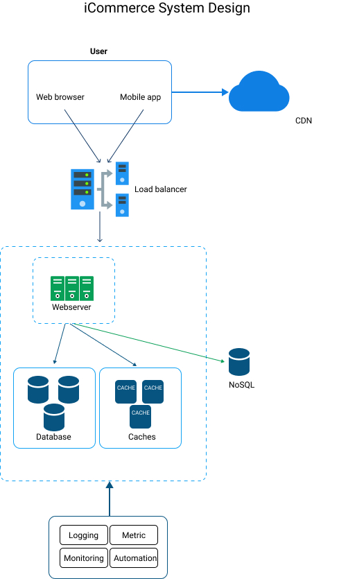
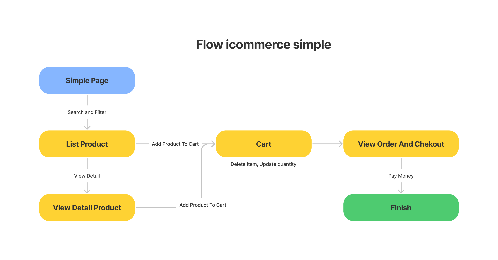
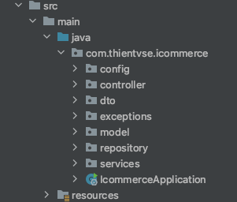

# icommerce
MVP for startup company

### 1. Overview
#### 1.1 Outline use cases, constraints, and assumptions
<li>What does the system do?
<ul>
<li>Get a list of products by filtering multiple criteria including category, price, brand,colour<li>
Add a product to shopping cart
</ul>

<li>What are the inputs and outputs of the system?
<ul>
<li>Input: Search and filter by name, category, price, brand, colour</li>
<li>Output: List product in cart and checkout</li>
</ul>

#### 1.2 Create a high level design

#### 1.3 Design core components

<li> Search product and filter with name, category, brand, color</li>

<li> Add product to card: update quantity cart, delete product in cart</li>

#### 1.4 Activity Flow

### 2. Database design
#### 2.1 ER diagram

### 3. TechStack
<li>Java 8</li>
<li>Springboot</li>
<li>MySQL</li>
<li>Github</li>

### 4. Sourcecode Structure

<li> Config: load confid
<li> Controller: binds everything together right from the moment a request, the reponse is prepared and sent back.
<li> DTO : it have a class DTO, DTO transfer only the data that we need to share with the user interface.
<li> Exceptions : custome exception.
<li> Model : Various models of the application are organised under the model package.
<li> Repository: interface provide some function to CRUD database.
<li> Service: To persist and retrieve the data from repository

### 4. Deploy and Expand.

#### 4.1 Deploy

#### 4.2 Expand