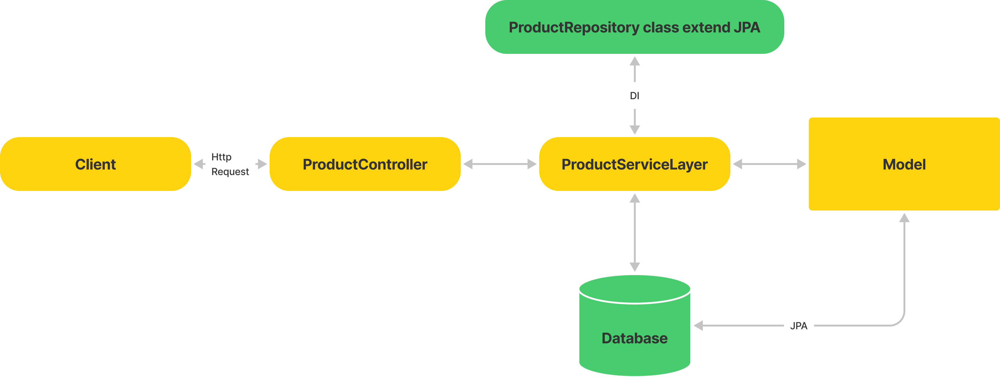
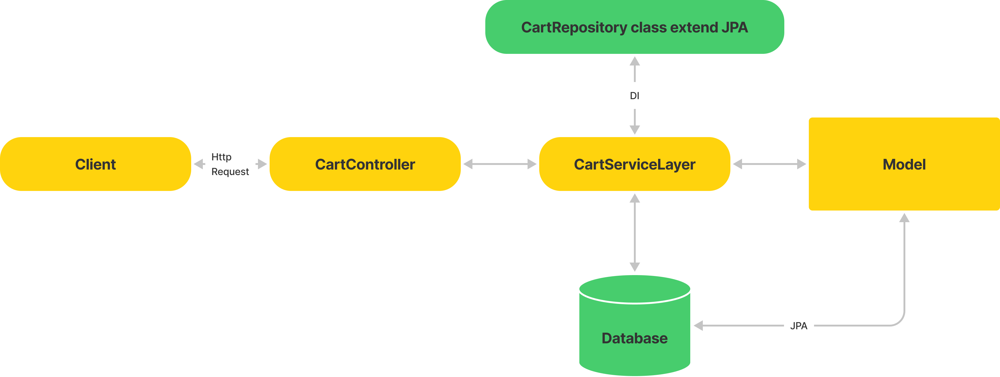

# icommerce
MVP for startup company

### 1. Overview
#### 1.1 Outline use cases, constraints, and assumptions

<li>Use cases</li>
<ul>
<li>User search keywords</li>
<li>User filter with other params</li>
<li>User click detail</li>
<li>User add product to cart</li>
</ul>

<li>What does the system do?
<ul>
<li>Get a list of products by filtering multiple criteria including category, price, brand,colour<li>
Add a product to shopping cart
</ul>


<li>What are the inputs and outputs of the system?
<ul>
<li>Input: Search and filter by name, category, price, brand, colour</li>
<li>Output: List product in cart and checkout</li>
</ul>


#### 1.2 Create a high level design


#### 1.3 Design core components

<li> Product component</li>



<li> Cart Component</li>




#### 1.4 Activity Flow


### 2. Database design
#### 2.1 ER diagram


### 3. TechStack
<li>Java 8</li>
<li>Springboot</li>
<li>MySQL</li>
<li>Github</li>


### 4. Sourcecode Structure


<li> Config: load confid
<li> Controller: binds everything together right from the moment a request, the reponse is prepared and sent back.
<li> DTO : it have a class DTO, DTO transfer only the data that we need to share with the user interface.
<li> Exceptions : custome exception.
<li> Model : Various models of the application are organised under the model package.
<li> Repository: interface provide some function to CRUD database.
<li> Service: To persist and retrieve the data from repository

### 4. Deploy and Expand.

#### 4.1 Deploy


Clone source code
> git clone https://github.com/thientvse/icommerce.git

Move to project folder
> cd icommerce

Build project
> mvn clean package -DskipTest

Run project with docker-compose.yml

> docker-compose up -d


#### 4.2 Test API

#### 4.2.1 Search Product:

<li> The <b>User</b> type keyword and request to the <b>Web Server</b> </li>
<li> The <b>Webserver</b> forward to the <b>Search API</b> </li>
<li> The <b>Search API</b> contact with the Product Service, which does the following:</li>
<ul>
<li>Queries data from <b>Product</b> table</li>
<li>Return data</li>
</ul>

```bash
curl --location --request GET 'localhost:8080/api/v1/productController/searchProduct' \
--header 'Content-Type: application/json' \
--data-raw '[
{
"key":"productName",
"value":"Samsung",
"operation":"MATCH"
}
]'
```
Result
```bash
[
    {
        "id": 1,
        "productName": "Điện thoại Samsung",
        "description": "Một sản phẩm của Samsung",
        "categoryId": 1,
        "brandId": 1,
        "colorId": 1,
        "quantity": 100,
        "unitPrice": 1000
    },
    {
        "id": 3,
        "productName": "Tủ lạnh Samsung",
        "description": "Một sản phẩm của Samsung",
        "categoryId": 2,
        "brandId": 1,
        "colorId": 2,
        "quantity": 50,
        "unitPrice": 500
    }
]
```

#### 4.2.2 Filter By Category

<li> The <b>User</b> choose option filter request to the <b>Web Server</b> </li>
<li> The <b>Webserver</b> forward to the <b>Search API</b> </li>
<li> The <b>Search API</b> contact with the Product Service, which does the following:</li>
<ul>
<li>Queries data from <b>Product</b> table</li>
<li>Filter data with options</li>
<li>Return data</li>
</ul>


```bash
curl --location --request GET 'localhost:8080/api/v1/productController/searchProduct' \
--header 'Content-Type: application/json' \
--data-raw '[
    {
        "key":"productName",
        "value":"Samsung",
        "operation":"MATCH"
    },
    {
        "key":"categoryId",
        "value":1,
        "operation":"EQUAL"
    }
]'
```
Result
```bash
[
    {
        "id": 1,
        "productName": "Điện thoại Samsung",
        "description": "Một sản phẩm của Samsung",
        "categoryId": 1,
        "brandId": 1,
        "colorId": 1,
        "quantity": 100,
        "unitPrice": 1000
    }
]
```
#### 4.2.3 Add Product To Cart

<li> The <b>User</b> click add product to cart and request to the <b>Web Server</b> </li>
<li> The <b>Webserver</b> forward to the <b>Cart API</b> </li>
<li> The <b>Cart API</b> contact with the Cart Service, which does the following:</li>
<ul>
<li>Insert data to <b>Cart</b> table</li>
<li>Return data</li>
</ul>

```bash
curl --location --request POST 'localhost:8080/api/v1/cartController/addProductToCart' \
--header 'Content-Type: application/json' \
--data-raw '{
    "productId":1,
    "stock":3
}'
```
Result

```bash
{
    "cartId": 1,
    "userId": 1,
    "product": {
        "id": 1,
        "productName": "Điện thoại Samsung",
        "description": "Một sản phẩm của Samsung",
        "categoryId": 1,
        "brandId": 1,
        "colorId": 1,
        "quantity": 100,
        "unitPrice": 1000
    },
    "stock": 3,
    "price": 3000,
    "status": null,
    "createdAt": "2022-03-24T17:51:20.108",
    "updatedAt": "2022-03-24T17:51:20.108"
}
```

#### 4.2.4 Get List Product in Cart

<li> The <b>User</b> click to cart and request to the <b>Web Server</b> </li>
<li> The <b>Webserver</b> forward to the <b>Cart API</b> </li>
<li> The <b>Cart API</b> contact with the Cart Service, which does the following:</li>
<ul>
<li>Queries data from <b>Cart</b> table</li>
<li>Return data</li>
</ul>


```bash
curl --location --request GET 'localhost:8080/api/v1/cartController/getListProductFromCartByUserId/1' \
--header 'Content-Type: application/json' \
--data-raw '{
    "productId":1,
    "stock":1
}'
```
Result
```bash
[
    {
        "cartId": 1,
        "userId": 1,
        "product": {
            "id": 1,
            "productName": "Điện thoại Samsung",
            "description": "Một sản phẩm của Samsung",
            "categoryId": 1,
            "brandId": 1,
            "colorId": 1,
            "quantity": 100,
            "unitPrice": 1000
        },
        "stock": 3,
        "price": 3000,
        "status": null,
        "createdAt": "2022-03-24T17:51:20",
        "updatedAt": "2022-03-24T17:51:20"
    }
]
```

### 5. Scale the design

Monitor the system to address bottlenecks and optimize its.

<li>Load balancer</li>
<li>Horizontal scaling</li>
<li>Caching</li>
<li>Database sharding</li>

Note 
> mvn clean package -DskipTests
> 
> docker-compose up --build --force-recreate
